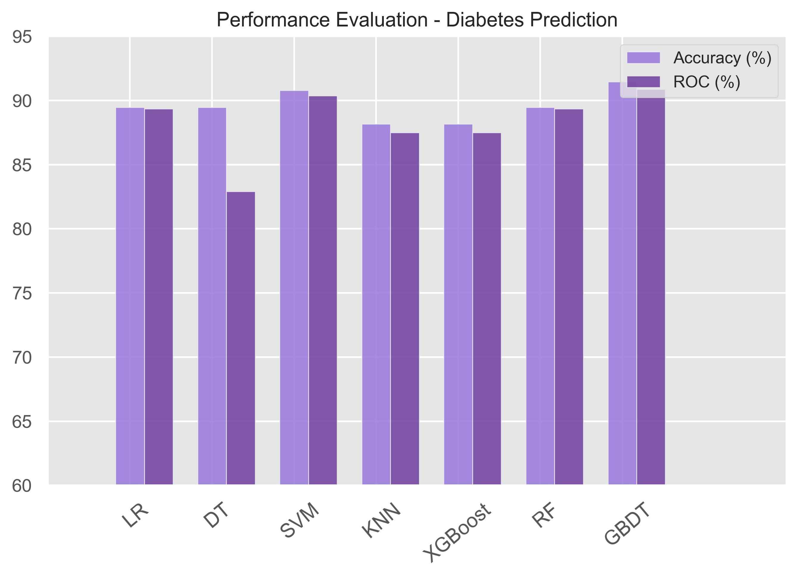
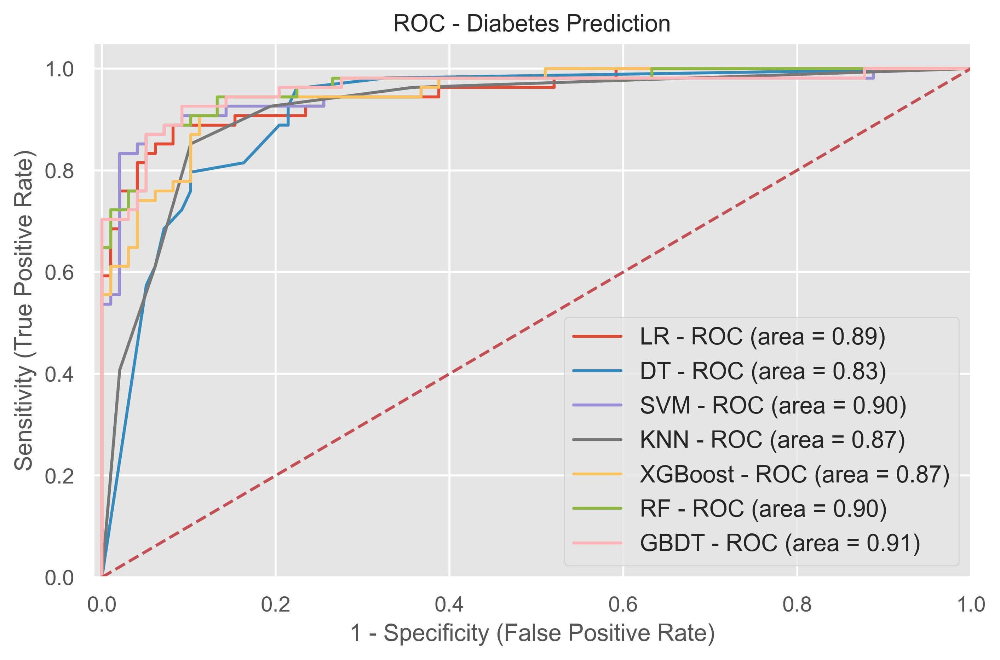

# Diabetes Prediction Using Logistic Regression, SVM, Decision Trees, Random Forest, XGBoost, and Gradient Boosting

## Project Overview

This project focuses on predicting whether an individual is diabetic based on the Pima Indians Diabetes dataset. The project includes exploratory data analysis (EDA), data preprocessing, feature engineering, and the application of multiple machine learning algorithms such as Logistic Regression, K-Nearest Neighbors (KNN), Support Vector Machine (SVM), Decision Trees, Random Forest, Gradient Boosting, and XGBoost. The model performance is evaluated using accuracy, confusion matrix, classification report, and ROC curves.

## Features

- **Exploratory Data Analysis (EDA)**: Visualizations of dataset distributions, correlations, and statistics.
- **Data Preprocessing**: Handling missing values, outlier detection and removal, and normalization of numerical features.
- **Feature Engineering**: New features based on BMI, insulin, and glucose levels.
- **Machine Learning Models**: Implementation of multiple classification algorithms and hyperparameter tuning using GridSearchCV.
- **Performance Evaluation**: Comparison of models using accuracy and ROC AUC scores.

## Tech Stack

- **Python 3.10**
- **Pandas**
- **Numpy**
- **Seaborn**
- **Matplotlib**
- **Scikit-learn**
- **XGBoost**

## Requirements

- **Python 3.10**
- **Pandas**
- **NumPy**
- **Scikit-learn**
- **XGBoost**
- **Seaborn**
- **Matplotlib**

## Installation

1. Clone the repository:

    ```bash
    git clone https://github.com/yourusername/Diabetes-Prediction.git
    cd Diabetes-Prediction
    ```

2. Install the necessary dependencies:

    ```bash
    pip install -r requirements.txt
    ```

3. Make sure the `diabetes.csv` dataset is in the working directory.

## Code Structure

**1. Exploratory Data Analysis (EDA):**
   - Distribution of features.
   - Correlation heatmap.
   - Visualization of missing values and outlier detection.

**2. Data Preprocessing:**
   - Handle missing values with median imputation based on the outcome (diabetes or healthy).
   - Remove outliers using the Local Outlier Factor (LOF).
   - Feature scaling with `StandardScaler`.

**3. Feature Engineering:**
   - New features such as `NewBMI` (categorized BMI) and `NewInsulinScore`.
   - Categorical encoding for new features using one-hot encoding.

**4. Machine Learning Models:**
   - Models implemented:
     - Logistic Regression
     - K-Nearest Neighbors (KNN)
     - Support Vector Machine (SVM)
     - Decision Tree Classifier
     - Random Forest Classifier
     - Gradient Boosting Classifier
     - XGBoost Classifier

**5. Hyperparameter Tuning:**
   - Grid search for hyperparameter optimization of models such as SVM, Decision Trees, and Gradient Boosting.

**6. Model Evaluation:**
   - Accuracy score, confusion matrix, and classification report.
   - ROC curves and AUC score comparison for all models.

## Results

The results for the models are presented in terms of:
- **Accuracy (%)**
- **ROC AUC (%)**

### Performance Evaluation Plot:
The bar plot below compares the accuracy and ROC-AUC scores for different models:



### ROC Curves:
The ROC curve plot for all the models to visualize the sensitivity and specificity:



## Model Deployment

The best-performing model is saved as `diabetes.pkl` using `pickle`.
